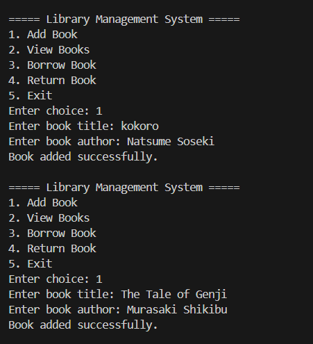
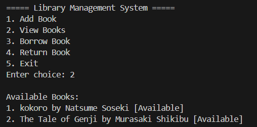
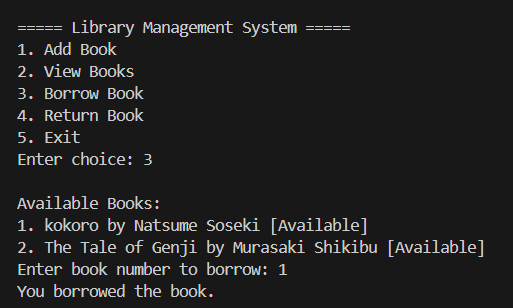
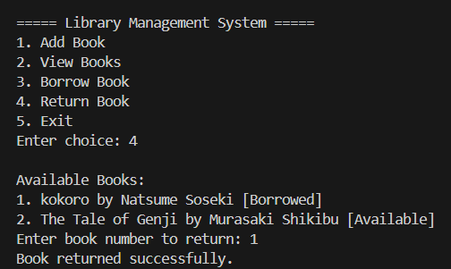
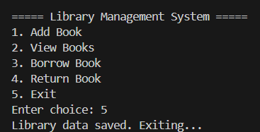

# LibraryManagementSystem
A Java-based Library Management System enabling book addition, borrowing, returning, and viewing. Data is stored in a text file, ensuring persistent records and efficient library operations through a user-friendly menu interface.

<h3 align="center">🎮 Output Screenshots</h3>

  
  
  
  
  

